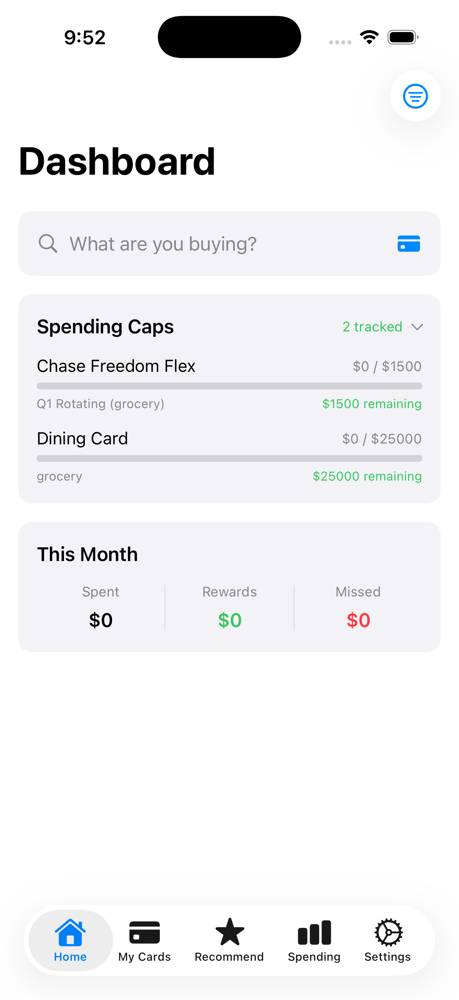
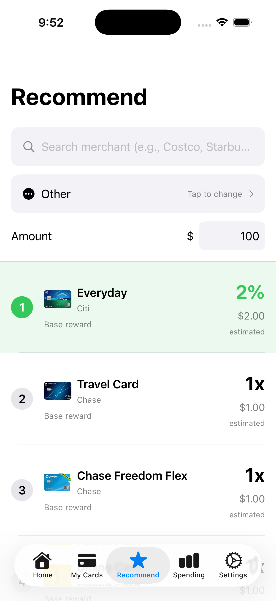
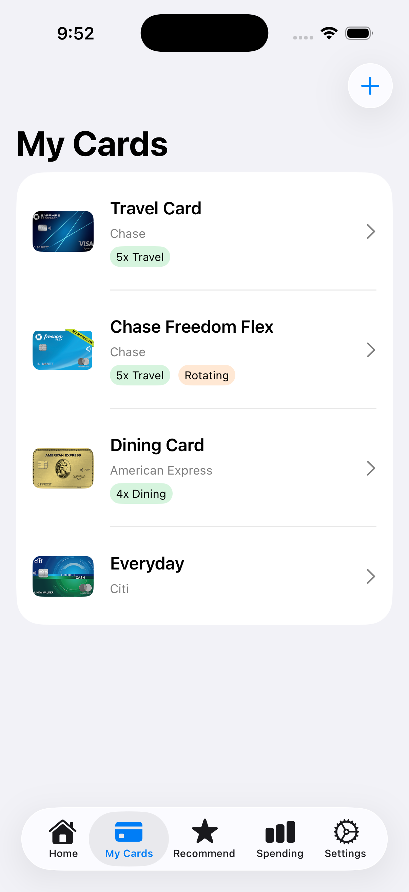
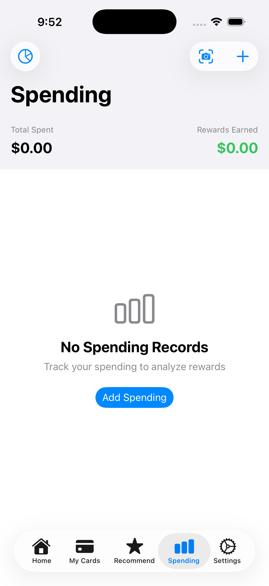

# SmartCard

> 智慧推薦，讓你的信用卡回饋最大化

一款 iOS App，幫助你在每次消費時選擇最佳信用卡，不再錯過任何回饋。

[](https://swift.org/)
[](https://developer.apple.com/ios/)
[](../LICENSE)
[](../COMMERCIAL_LICENSE.md)

---

## 螢幕截圖

<p align="center">
  
  
  
  
</p>

---

## 功能特色

| 功能 | 說明 |
|------|------|
| **智慧推薦** | 根據商家或消費類別推薦最佳信用卡 |
| **60+ 信用卡** | 完整美國主流信用卡資料庫，含準確回饋資訊 |
| **回饋追蹤** | 追蹤固定、輪轉、自選類別回饋 |
| **消費分析** | 互動式圖表呈現消費模式 |
| **收據掃描** | OCR 快速記錄消費 |
| **開卡禮追蹤** | 追蹤開卡禮進度，不錯過期限 |
| **主畫面小工具** | 不用開 App 就能查看推薦 |
| **隱私優先** | 使用者資料透過 Firebase 同步，卡片資料來自官方來源 |

### 支援卡片

**60+ 張美國主流信用卡：**
- **Chase** - Sapphire Preferred/Reserve, Freedom Flex/Unlimited, Ink Business, Amazon Prime, United, Southwest, Marriott
- **American Express** - Gold, Platinum, Blue Cash Preferred/Everyday, Delta SkyMiles, Hilton Honors
- **Citi** - Double Cash, Custom Cash, Premier, Strata Premier, Costco Anywhere, AAdvantage
- **Capital One** - Savor/SavorOne, Venture X/Venture, Quicksilver
- **Discover** - it Cash Back, Chrome, Miles, Student
- **Bank of America** - Customized Cash, Premium Rewards, Travel Rewards, Alaska Airlines
- **US Bank** - Cash+, Altitude Go/Connect/Reserve
- **Wells Fargo** - Active Cash, Autograph/Journey
- **其他** - Apple Card, Bilt, PayPal, Venmo, Target RedCard, Walmart

### 支援卡片類型

| 類型 | 範例 | 運作方式 |
|------|------|----------|
| **固定類別** | Amex Gold 餐飲 4x | 永遠享有加碼回饋 |
| **輪轉類別** | Chase Freedom Flex 5% | 每季輪替，需啟用 |
| **自選類別** | BoA Customized Cash 3% | 自選一個加碼類別 |

---

## 示範

**立即體驗：** [加入 TestFlight Beta](#) *(即將推出)*

---

## 快速開始

### 系統需求

- iOS 17.0+
- Xcode 15+
- Swift 5.9+

### 安裝

```bash
# Clone 儲存庫
git clone https://github.com/Rich627/SmartCard.git

# 用 Xcode 開啟
cd SmartCard
open SmartCard.xcodeproj

# 建置並執行 (Cmd + R)
```

---

## 運作原理

```
┌─────────────────┐     ┌──────────────────┐     ┌─────────────────┐
│   輸入商家名稱   │ ──▶ │   類別對應資料庫  │ ──▶ │     推薦引擎     │
│    或消費類別   │     │                  │     │                 │
└─────────────────┘     └──────────────────┘     └─────────────────┘
                                                          │
                                                          ▼
                                                 ┌─────────────────┐
                                                 │    最佳卡片 +    │
                                                 │    回饋金額      │
                                                 └─────────────────┘
```

**推薦引擎** 會考量以下因素評估所有卡片：
- 固定類別加碼倍率
- 當季輪轉類別（啟用狀態）
- 使用者自選加碼類別
- 消費上限與剩餘額度
- 點數/哩程價值

---

## 架構

```
SmartCard/
├── App/                    # App 進入點
├── Models/                 # 資料模型
│   ├── CreditCard.swift    # 卡片定義與回饋設定
│   ├── Spending.swift      # 交易紀錄
│   ├── Merchant.swift      # 商家 → 類別對應
│   └── SpendingCategory.swift
├── Views/                  # SwiftUI 視圖 (MVVM)
│   ├── Home/               # 主控台
│   ├── Cards/              # 卡片管理
│   ├── Spending/           # 消費追蹤與圖表
│   ├── Recommend/          # 卡片推薦
│   └── Settings/           # App 設定
├── ViewModels/             # 狀態管理
├── Services/               # 商業邏輯
│   ├── FirebaseService.swift    # Firestore 資料同步
│   ├── RecommendationEngine.swift
│   ├── OCRService.swift
│   └── NotificationService.swift
└── Utils/                  # 擴充與輔助工具

Functions/                  # 後端服務
├── scraper/               # 信用卡資料爬蟲
│   ├── index.js           # 爬蟲主程式
│   ├── scrapers/          # 各發卡機構爬蟲
│   └── upload-to-firestore.js
└── index.js               # Firebase Cloud Functions
```

---

## 技術棧

| 類別 | 技術 |
|------|------|
| UI | SwiftUI |
| 架構 | MVVM |
| 響應式 | Combine |
| 小工具 | WidgetKit |
| OCR | Vision Framework |
| 後端 | Firebase Firestore |
| 認證 | Firebase Auth（可選） |
| 爬蟲 | Node.js + Puppeteer |

---

## 測試

```bash
# 執行所有測試 (在 Xcode 按 Cmd + U)

# 或透過命令列
xcodebuild test -scheme SmartCard -destination 'platform=iOS Simulator,name=iPhone 15'
```

**測試涵蓋範圍：**
- `RecommendationEngineTests` - 卡片推薦邏輯
- `MerchantDatabaseTests` - 商家對類別對應
- `ModelTests` - 資料模型編解碼
- `SearchHistoryManagerTests` - 搜尋歷史功能

---

## 貢獻

歡迎貢獻！請參閱 [CONTRIBUTING.md](../CONTRIBUTING.md) 了解指引。

### 快速貢獻指南

1. Fork 此儲存庫
2. 建立功能分支 (`git checkout -b feature/AmazingFeature`)
3. 提交變更 (`git commit -m 'Add some AmazingFeature'`)
4. 推送到分支 (`git push origin feature/AmazingFeature`)
5. 開啟 Pull Request

---

## 授權

本專案採用雙重授權：

- **開源授權：** [AGPL-3.0](../LICENSE) - 個人與非商業使用免費
- **商業授權：** [付費授權](../COMMERCIAL_LICENSE.md) - 商業/專有軟體使用

如需在商業產品中使用 SmartCard 且不開源，請[聯絡我們](mailto:your@email.com)取得商業授權。

---

## 支援

- [回報錯誤](https://github.com/Rich627/SmartCard/issues)
- [功能建議](https://github.com/Rich627/SmartCard/issues)
- 覺得有用的話請給顆星！

---

## 致謝

- 信用卡資料來源為公開發卡機構資訊
- 圖示使用 SF Symbols

---

<p align="center">
  為信用卡愛好者用心打造
</p>
